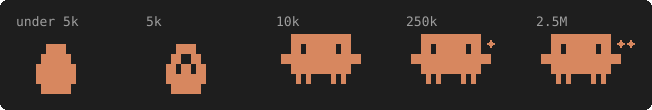

# claude-saver

[](LICENSE)


Spend fewer tokens in [Claude Code](https://claude.com/claude-code) without changing how you work.

Every API call re-sends your CLAUDE.md, memory, tool schemas and the whole conversation.
claude-saver trims what gets re-sent, shows you when it's about to get expensive,
and tells you what each saver actually saved. Pure Python stdlib, one install command, no daemon.

In Claude Code:

```
/plugin marketplace add pianburp/claude-saver
/plugin install ctx-saver@pianburp
/ctx-saver:setup
```

`/ctx-saver:setup` finds a Python 3.8+ on your machine, lists every `settings.json` change and asks before writing.
Add `--all` for the ponytail, caveman and graphify plugins: `/ctx-saver:setup --all`.
After a plugin update, run `/ctx-saver:setup` again.

Without the plugin, pipe the installer into Python (same flags):

```sh
# macOS / Linux
curl -fsSL https://raw.githubusercontent.com/pianburp/claude-saver/main/install.py | python3 -
# Windows (PowerShell). No `py` launcher? Use `python -` instead.
irm https://raw.githubusercontent.com/pianburp/claude-saver/main/install.py | py -
```

Restart Claude Code. A line starting with `✻` shows up under the prompt.

## What you get

| Piece | What it does | When |
|-------|--------------|------|
| [Status line](#status-line) | Context, usage limits, prompt cache countdown. Hints `/compact` before auto-compact, `/clear` once the cache is cold | Always on |
| [Auto-compact at 50%](#auto-compact) | Compacts at half the window instead of near full | Automatic |
| [Deny rules](#deny-rules) | Claude never reads `node_modules`, `__pycache__`, `.venv`, `venv`, `.next`, `coverage`, `.env`, `.env.local`, `.env.*.local` | Automatic |
| [Startup check](#startup-check) | One line when something wastes tokens every session. Silent otherwise | Automatic |
| [Output guard](#output-guard) | Tells Claude when a Bash output is 2k+ tokens, so it uses quiet flags next time | Automatic |
| [Secret guard](#secret-guard) | Blocks reading `.env` files and writing hardcoded API keys | Automatic |
| [`/token-audit`](#token-audit) | Finds what loads before you type, proposes cuts as diffs | On demand |
| [`/savings`](#savings) | This session's tokens and what each saver saved. `--week`: per day | On demand |
| [`/wrapped`](#wrapped) | Your week with Claude as a Wrapped-style page | On demand |
| [`/toggle`](#toggle) | Turns the pet and the three hooks on or off mid-session | On demand |
| [`--orchestrate`](#--orchestrate) | Plans on Opus, executes on Sonnet, subagents on Haiku | Opt-in |
| [`--pet`](#pet) | A status line pet that eats the tokens you save | Opt-in |
| [caveman](https://github.com/JuliusBrussee/caveman) | Shorter replies: 65% fewer output tokens on average | Opt-in (`--with-plugins`, `--all`) |
| [ponytail](https://github.com/DietrichGebert/ponytail) | Less code written: 80-94% fewer lines in its benchmark | Opt-in (`--with-plugins`, `--all`) |
| [graphify](https://github.com/safishamsi/graphify) | Claude queries a code graph instead of re-reading files | Opt-in (`--all`) |

caveman, ponytail and graphify are third-party projects. claude-saver only installs them and measures them.

## Status line

```
✻ Opus 5.5 · hi · pony full + cave · saved ~18.3k
⎿ ctx ██░░░░ 31% · 5h 63% 12:51p · 7d 91% Thu · ● 52m
```

- **Line 1:** model, effort (`lo`, `med`, `hi`, `xhi`, `max`), active ponytail/caveman modes, `saved` (estimated tokens saved this session, the `total` row of [`/savings`](#savings)).
- **Line 2:** `ctx` is context used. `5h` and `7d` are your usage limits and when they reset: the time when under 24h away, else the day.
  `● 52m` is time left on the prompt cache. The pie drains `● ◕ ◑ ◔` as it runs down, gray until its last 5 minutes, `○ cold` once it expires.
  After that, the next message re-reads the whole conversation at full price.
- Numbers go green, then yellow at 50%, then red at 80%. The context bar stays Claude orange under 50%.
- `/compact` shows 10 points before auto-compact (40% by default). Compact at a clean break, not mid-task.
- `/compact` also shows in the cache's last 5 minutes when context is over 20%. Compacting while the cache is warm is cheap. After it expires, the next message re-bills everything.
- `/clear` replaces it once the cache has expired and context is over 20%. If you're switching tasks, starting fresh is cheaper.
- Segments with no data are hidden.

It redraws every second. Animation follows the clock, so bursts of redraws don't speed it up:
`✻` spins while Claude works, rising numbers count up over 3 seconds and glow peach for 15,
and the cache timer pulses red in its last 5 minutes.

Only plain Unicode glyphs (`✻ ⎿ █ ░ · ●`) are used. No Nerd Font needed.

### Pet

`/ctx-saver:setup --pet` puts Clawd, Claude Code's mascot, left of the status line, three rows tall as on Claude Code's welcome banner.
It eats the `saved` count from every session.
It costs no tokens: the status line is never sent to the model.
The status line credits each session's savings to `~/.claude/.statusline-ctx/ledger.json`, pet or not.
`/toggle pet` shows or hides it mid-session. `/pet` shows its stage, age, lifetime savings and progress to the next stage.



It glows when it grows. Its eyes, arms and color follow the session, first match wins:

| Clawd | When |
|-------|------|
| `▚ ▞` eyes, red | A tool output of 2k+ tokens just landed (15 seconds) |
| `▀ ▀` eyes and `z`, gray | Cache cold: asleep |
| red | Context in `/compact` range |
| pulsing red | Cache in its last 5 minutes |
| arms wave `▝▜█████▛▘` / `▗▟█████▙▖` | Claude working. The egg rocks |
| orange, blinking every 7 seconds | Otherwise |

It takes 11 columns, so the rest of the status line shifts right.

`--uninstall` deletes `.statusline-ctx/`, pet included.

## Automatic

### Auto-compact

Sets `CLAUDE_AUTOCOMPACT_PCT_OVERRIDE=50`. Long sessions drift, and every call re-reads the full history.
The variable is read by Claude Code but undocumented, so it may change. The documented alternative is
`autoCompactWindow` (a token count). A value you already set is kept.

### Deny rules

Adds these to `permissions.deny` in `~/.claude/settings.json`, so they apply to every project:

```
Read(**/node_modules/**)  Read(**/__pycache__/**)  Read(**/.venv/**)
Read(**/venv/**)          Read(**/.next/**)        Read(**/coverage/**)
Read(**/.env)             Read(**/.env.local)      Read(**/.env.*.local)
```

The `.env` rules keep secrets out of the API. They name each file instead of using a wildcard, so `.env.example` stays readable.
Deny rules cover Claude's file tools, not shell commands like `cat .env`.
Your own rules are kept. To unblock one, delete its rule. Re-running the installer adds it back.

### Startup check

A `SessionStart` hook (new sessions only) runs `saver.py check`. It prints nothing unless something needs fixing:

- An instruction file (CLAUDE.md, AGENTS.md, rules, MEMORY.md) is over 500 tokens, or MEMORY.md is past the 200 lines / 25KB that load.
- A heavy folder isn't in `permissions.deny`: `dist`, `build`, `target`, the ones above, or any folder in the project's `.gitignore` with 1000+ files.
- Project MCP servers (`.mcp.json`) are configured while `ENABLE_TOOL_SEARCH` is off, so every tool schema loads up front.

When it does print, it's one line (~40 tokens) telling Claude to suggest `/token-audit`.

### Output guard

A `PostToolUse` hook on Bash runs `saver.py guard`. When a command prints 2k+ tokens, Claude gets one line (~40 tokens):

```
claude-saver: `npm test` printed ~7.5k tokens, re-sent on every later call. Next time use quiet flags (-q, --silent, --reporter=dot), pipe through tail or grep, or run it in a subagent.
```

The count stops at `BASH_MAX_OUTPUT_LENGTH` (30000 chars by default), the most Claude sees. Smaller outputs print nothing.

### Secret guard

A `PreToolUse` hook runs `saver.py secrets`. It denies two things:

- **Touching `.env` files** from Bash, PowerShell, Read, Grep or Glob (`.env`, `.env.local`, `.env.production.local`). A secret printed into the transcript can't be taken back. Deny rules on `Read()` alone miss `grep KEY .env` in a shell. `.env.example`, `.sample`, `.template` and `.dist` stay readable.
- **Writes that hardcode a key**: a Write, Edit or MultiEdit containing an Anthropic, OpenAI, Stripe live, AWS, GitHub, Google or Slack key, or a private key block. Writes to `.env*` files are allowed, since that's where keys belong.

It matches known key prefixes only, with no entropy scan. Bash heredocs are not scanned.

## On demand

### /token-audit

Lists every file Claude Code loads each session (global and project CLAUDE.md, `@imports`, rules, auto memory) with its token cost.
`AGENTS.md` counts when no CLAUDE.md exists. It flags:

- Files over 500 tokens, code blocks over 10 lines, stale paths, and lines repeated across files.
- A MEMORY.md too long to load in full, and rules without `paths:` frontmatter (those load every session).
- Project MCP servers (`.mcp.json`), unblocked heavy folders, and a `.claudeignore` (Claude Code doesn't read it).
- Subagents on your main model (and custom agents with no `model:`), no `## Compact instructions` section, and an unset `BASH_MAX_OUTPUT_LENGTH`.
- A 5-minute prompt cache when `ENABLE_PROMPT_CACHING_1H` is off.

Claude then proposes cuts as diffs and applies only the ones you approve, after a `.bak` backup.

Tip: HTML comments `<!-- -->` in CLAUDE.md cost zero tokens. Put notes for humans there.

### /savings

```
Session 9e1585f1: 13 API calls
  used     input 26 · cache write 45.2k · cache read 752.2k · output 18.0k

Saved **estimated
  caveman     ~2.5k output  65% avg cut on 1.4k reply tokens (caveman benchmark)
  ponytail   ~15.7k output  80% fewer lines on 3.9k code tokens (ponytail benchmark, low end)
  total      ~18.3k

  prompt cache  752.2k input tokens billed at 10% (exact, built into Claude Code)
```

`used` and `prompt cache` are exact, read from the session transcript. `Saved` rows are estimates:

- **caveman:** reply tokens × the published 65% average cut.
- **ponytail:** code tokens written × the published 80% low-end cut.
- **graphify:** assumes each graph query replaced 5 file reads of this session's average size.
  This is a guess. For a real number on your repo, run `graphify benchmark`.

It also lists the three biggest tool outputs (2k+ tokens) with their command.
They stay in context and are re-read on every later call, so add quiet flags (`--reporter=dot`, `-q`) or run them in a subagent.
It counts model switches too: the prompt cache is per model, so each switch re-writes the whole conversation.

`/savings --week` shows tokens saved per day over the last 7 days, from the ledger the status line keeps:

```
Saved per day **estimated, recorded by the status line
  Tue 09-29  ████████              ~8.1k
  Wed 09-30                        -
  ...
  Mon 10-05  ████████████████████  ~20.4k
  total                            ~61.3k
```

Only sessions with the status line running count.

### /wrapped

Your last 7 days across every project, as a Spotify Wrapped-style page that opens in your browser.
The cards show API calls, top project, busiest day, peak hour, favourite tool, tokens written, tokens saved, the loudest command, calls per day and your pet.
It reads the session transcripts and the ledger, and writes `~/.claude/.statusline-ctx/wrapped.html`. Nothing leaves your machine.

### /toggle

Turns a feature on or off without editing `settings.json` or restarting:

```
/toggle                 list switches
/toggle pet             flip one
/toggle secrets off     set one
```

```
Switches (take effect now, no restart):
  pet      on   Clawd on the status line
  check    on   startup check (SessionStart hook)
  guard    off  big-output guard (PostToolUse hook)
  secrets  on   secret guard: blocks .env reads and hardcoded keys (PreToolUse hook)
```

Switches live in `~/.claude/.statusline-ctx/config.json` and persist across sessions.
The status line and the hooks read it on every run, so a change applies on the next redraw or tool call.
A switch you set beats the installer's `--pet`.
caveman and ponytail have their own: `stop caveman` / `stop ponytail` for the session, `/plugin` to disable them everywhere.

## --orchestrate

Sets `"model": "opusplan"`: Opus in plan mode (Shift+Tab twice), Sonnet once you execute.
Also sets `CLAUDE_CODE_SUBAGENT_MODEL=haiku` for subagents with no model of their own.
It's not part of `--all`, because it replaces your default model. Switch back any time with `/model`.

## Habits

The tools can't do these for you:

- `/clear` between unrelated tasks. Old context is re-sent on every call.
- `/rewind` to undo a recent wrong turn instead of `/compact`. Everything before it stays cached.
- Pick `/model` and `/effort` at the start. Changing them mid-session rebuilds the cache.
- @-mention files you know are relevant. It skips the search and Read calls.
- Plan before you execute on anything non-trivial, and review the plan. Skip planning for one-line changes.
- Put all constraints in the first prompt, and batch related changes into one request.
- Run `/loop` in its own session, so each loop turn doesn't carry your main conversation.
- For routine work, `MAX_THINKING_TOKENS=0` cuts thinking output. It lowers quality on hard problems, so it's not set for you.

## Install

Needs Python 3.8+. No packages.

- **macOS:** if `python3 --version` prompts for developer tools, run `xcode-select --install` (or `brew install python`).
- **Linux:** install `python3` from your package manager.
- **Windows:** install from [python.org](https://www.python.org/downloads/). It includes the `py` launcher.

Use the one-liner at the top, or install from a clone:

```sh
git clone https://github.com/pianburp/claude-saver
cd claude-saver
python3 install.py          # Windows: py install.py
```

Flags (they combine, e.g. `--all --orchestrate`). With the one-liner, put them after the final `-`:

| Flag | Adds |
|------|------|
| `--with-plugins` | ponytail and caveman, through the `claude` CLI. Without the CLI, the installer prints the `/plugin` commands to run |
| `--graphify` | graphify via `uv` (or `pip --user`), then `graphify install` |
| `--all` | Both of the above |
| `--orchestrate` | opusplan + Haiku subagents |
| `--pet` | A [pet](#pet) left of the status line |
| `--yes` | Applies the `settings.json` changes without asking. Use it in scripts |
| `--uninstall` | Removes what the installer added (see below) |

New to Claude Code? Skip the plugins until you know the default behavior.
caveman and ponytail change how Claude talks and codes in every project. Say `stop caveman` / `stop ponytail` to turn them off.
graphify pays off in big repos: run `/graphify` once to build the graph. All three run third-party code, so read their repos first.

What the installer touches:

1. Lists every `settings.json` change and asks `Apply? [Y/n]`. Answering no leaves every file as it was.
   With no terminal to ask (output redirected), it applies them.
2. Copies `statusline.py` and `saver.py` to `~/.claude/`.
3. Writes the `/token-audit`, `/savings`, `/pet`, `/wrapped` and `/toggle` skills to `~/.claude/skills/` with `disable-model-invocation: true`.
   They cost no tokens until you type them.
4. Backs up `settings.json` and any existing `statusline.py` to `.bak`. This happens on the first run only, so the backup is never overwritten.
5. Merges into `settings.json`: `statusLine`, `CLAUDE_AUTOCOMPACT_PCT_OVERRIDE`, the deny rules, the startup hook, the output guard hook and the secret guard hook.
   It keeps your values for everything except `statusLine` (and `model` with `--orchestrate`).

**Update:** `/plugin` → **Marketplaces** → `pianburp` (turn on auto-update), then `/ctx-saver:setup` with the same flags. Without the plugin, re-run the install command with the same flags. Plugins update through `/plugin` → **Marketplaces** (turn on auto-update).

**Uninstall:** `/ctx-saver:setup --uninstall`, then `/plugin uninstall ctx-saver@pianburp`. Without the plugin, run the install command with `--uninstall`.

- It shows the `settings.json` changes and asks first, like the install does.
- It removes `statusline.py`, `saver.py`, `.statusline-ctx/` (pet and ledger included) and the five skills from `~/.claude/`.
- From `settings.json` it removes `statusLine`, the three hooks and the deny rules.
  It also removes `CLAUDE_AUTOCOMPACT_PCT_OVERRIDE`, `CLAUDE_CODE_SUBAGENT_MODEL` and `model`, but only if they still hold the installer's values. Values you set yourself stay.
- The plugins stay. Remove them via `/plugin`, and graphify with `graphify uninstall`.

### Troubleshooting

- **No status line:** copy `statusLine.command` from `~/.claude/settings.json` and run it as `echo {} | <command>`.
  It should print a line starting with `✻`.
- **`command not found` / `No such file`:** Python moved. Re-run the installer.
- **`cave no plugin`:** caveman is installed as plain skills (e.g. `npx skills add`), which write no mode flag.
  Re-run the installer with `--with-plugins`, then delete the `cave*` folders it lists from `~/.claude/skills/`.
- **Boxes or `?` instead of `✻ ⎿ █ ▐▛`:** your font lacks the glyphs. Use Cascadia, Menlo, JetBrains Mono or DejaVu Sans Mono.

## Settings

| Variable | Default | Effect |
|----------|---------|--------|
| `CLAUDE_CACHE_TTL` | detected | Prompt cache lifetime in seconds. Detected from the transcript's newest cache write (1h or 5m), `3600` until one exists. Set only to override. |
| `NO_COLOR` | unset | Any value turns colors off. |
| `COLORTERM` | set by terminal | `truecolor`/`24bit` gives a smooth glow fade. Otherwise it steps through 256 colors. |
| `CLAUDE_AUTOCOMPACT_PCT_OVERRIDE` | `50` (installer) | Context % where Claude Code auto-compacts. The `/compact` hint shows 10 points earlier. |
| `CLAUDE_CODE_SUBAGENT_MODEL` | `haiku` (`--orchestrate`) | Model for subagents with no model of their own. |
| `CLAUDE_CONFIG_DIR` | `~/.claude` | Where the installer, status line and saver look for config. |

## How it works

| File | Role |
|------|------|
| `.claude-plugin/`, `skills/setup/` | Plugin manifest, marketplace and `/ctx-saver:setup`, which runs `install.py` from the plugin folder. |
| `install.py` | Copies the scripts, writes the skills, merges `settings.json`. Works from a clone or piped from `curl`/`irm` (it fetches the other files from `main`). |
| `statusline.py` | Reads Claude Code's status line JSON on stdin and prints two lines. Per-session glow state lives in `~/.claude/.statusline-ctx/`. |
| `saver.py` | `audit`, `check`, `savings`, `pet`, `wrapped`, `guard`, `secrets` and `toggle`. Reads instruction files, settings, session transcripts (`~/.claude/projects/*/*.jsonl`) and the ledger. Writes only `wrapped.html` and the `/toggle` switches. |
| `test_*.py` | Plain `assert` tests, no framework. |
| `demo.py` | Plays the status line animations with fake data in a temp dir. Not installed. |
| `.github/workflows/upstream.yml` | Weekly job that fails if caveman, ponytail or graphify rename a flag file or marker that claude-saver reads. |

Token counts are `chars / 4`, the same approximation graphify and most tools use. Exact numbers come only from transcript `usage` fields.

## Development

```sh
python3 test_saver.py && python3 test_statusline.py      # both print "ok"
python3 demo.py                                          # watch every animation with fake data (15s)

# try the status line with fake input
echo '{"model":{"display_name":"Opus"},"context_window":{"used_percentage":42}}' | python3 statusline.py

# run the saver against any repo
cd ~/some/project && python3 /path/to/claude-saver/saver.py audit
```

Ground rules for PRs:

- **Stdlib only.** The installer is piped into `python3` on fresh machines.
- **Silent by default.** Hook output lands in Claude's context on every session, so `check` prints only when there's something to fix.
- **Never clobber user settings.** Use `setdefault`, keep existing values, back up once.
- **Cite estimates.** Any savings number needs a source or a `# guess` comment.
- **Add an assert.** New logic gets one check in the matching `test_*.py`.

Bug reports are most useful with your OS, Python version, and the output of `saver.py audit` or `echo {} | <statusLine command>`.

## Further reading

The automatic checks and audit tips come from these:

- [Claude Code token efficiency](https://www.firecrawl.dev/blog/claude-code-token-efficiency) (Firecrawl)
- [Maximizing the value of your Claude Code sessions](https://claude.com/blog/maximizing-the-value-of-your-claude-code-sessions) (Anthropic)
- [How to save tokens](https://mydataschool.com/blog/how-to-save-tokens/) (mydataschool)
- [Save tokens with Opus plan mode](https://www.mindstudio.ai/blog/save-tokens-claude-code-opus-plan-mode) (MindStudio)
- [10 tips to stop burning your tokens in Claude Code](https://medium.com/@habib23me/10-tip-to-stop-burning-your-tokens-in-claude-code-4776d4ac8956)

## License

[MIT](LICENSE)
